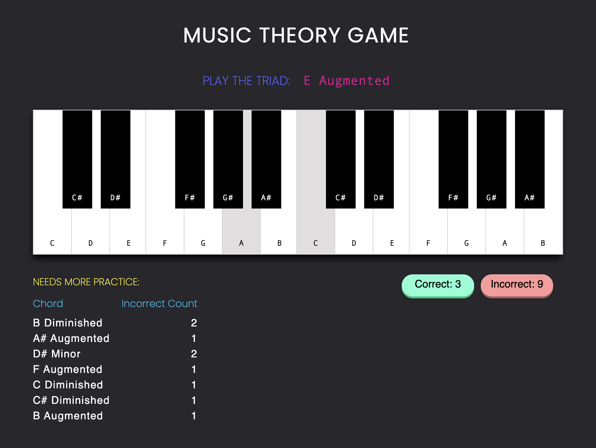

# [Music Theory App](https://cmillecan.github.io/music-app/)

An interactive and educational game for learning Major, Minor, Augmented and Diminished triads on a musical keyboard.

The app displays a virtual piano keyboard and generates a random note and quality (i.e. "G Major") to play. Includes a count tracker for correct and incorrect chords played, along with a section showing which chords a user missed, allowing them to see which ones need more practice. Try out the [demo](https://cmillecan.github.io/music-app/)!

Technologies:
`React.js` `Tones.js`